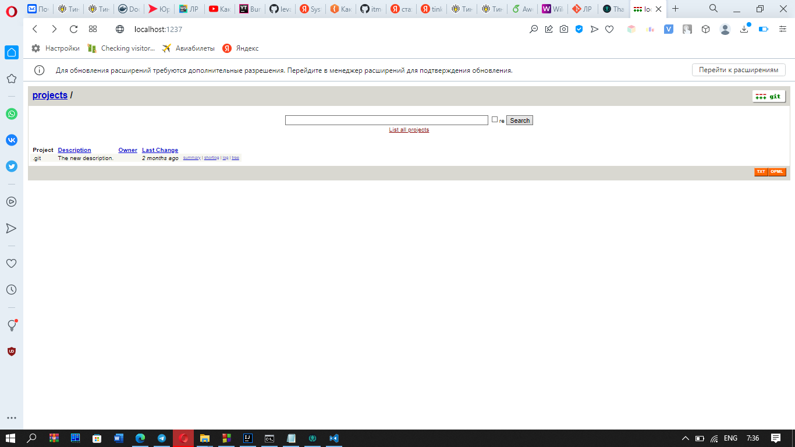
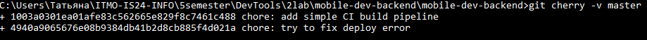
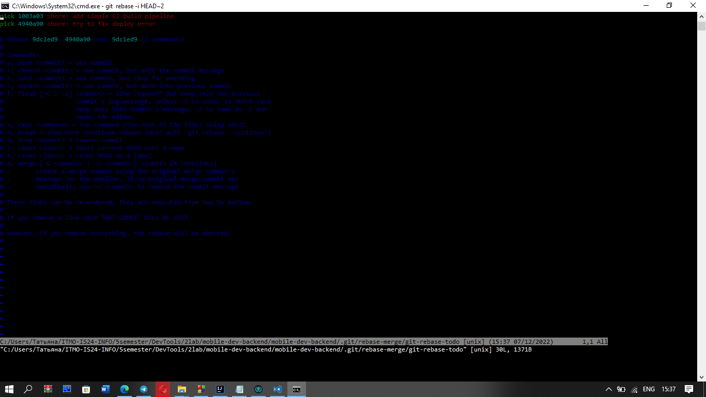
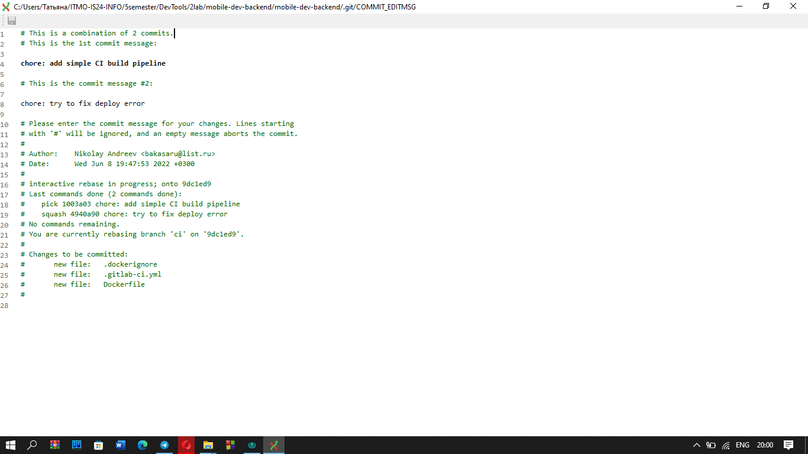
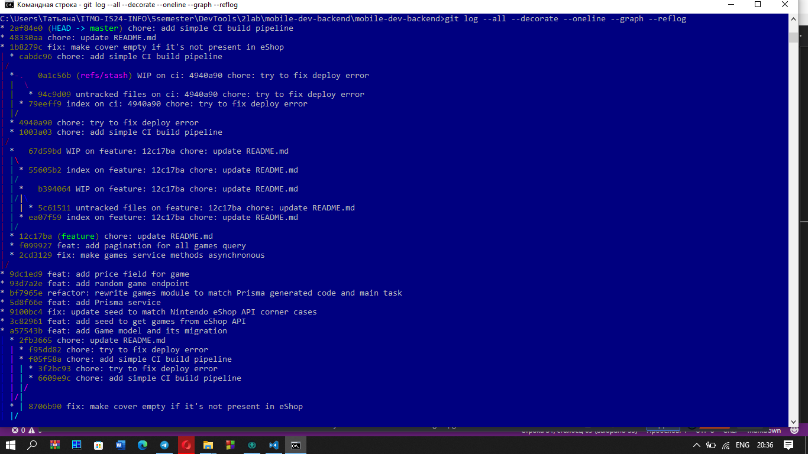
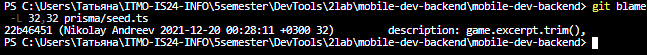

## 1. Запустите локальный веб-визуализатор репозитория и сделайте так, чтобы в нём отображалось нормальное описание репозитория.
Сначала войдём в wsl.
```
wsl 
```
Потом установим руби.
```
sudo apt-get install ruby 
sudo apt install libcgi-pm-perl 
sudo apt install libcgi-pm-perl --fix-missing 
```
Редактируем описание репозитория в папке .git/description
```
The new description.
```
Далее перезапускаем веб-визуализатор по команде
```
git instaweb --httpd=webrick
```
И по порту 1237 (а по дефолту 1234) находим веб-визуализатор

## 2. Перенесите все коммиты, находящиеся в ветке ci, в ветку master с объединением всех коммитов в один и изменением сообщения таким образом, чтобы оно полностью описывало все вносимые изменения. Удалите ветку ci.
Сначала перейдём на эту ветку
```
git checkout -f ci
```
Посмотрим на разницу между ветками \
 \
Нам необходимо засквошить эти 2 коммита
```
git rebase -i HEAD~2
```
Эта команда направляет нас в интерактивный git rebase, где для последнего коммита ветки ci нужно указать вместо pick - squash \
 \
После нас выкинет в редактирование сквош-коммита, где мы можем настроить название коммита
 \
Далее мы ребэйзим этот коммит с мастером и удаляем ветку.
```
git rebase master 
git checkout master 
git merge ci 
git branch -d ci 
```
## 3. В репозитории есть несколько альтернативных историй проекта, недоступных из текущей версии графа и не связанных с ней. Найдите последний коммит любой из версий и создайте на нём ветку old-master.
Чтобы получить список всех коммитов, воспользуемся такой командой:
```
git log --all --decorate --oneline --graph --reflog 
```
 \
Можно взять любой последний отходящий коммит, например, 22b4645 
```
git checkout 22b4645 
git checkout -b old-master 
```
## 4. Определите коммит, в котором строчка 32 файла prisma/seed.ts изменялась в последний раз, и его дату.
Чтобы посмотреть последний коммит с изменением 32 строки файла, необходимо использовать команду 
```
git blame -L 32,32 prisma/seed.ts 
```
 \
## 5. В проекте существует регресс, на который имеется тест, запускающийся по команде npm run test. Найдите коммит, в котором проявился регресс.
Чтобы мы могли прогонять тесты, нам нужно скачать node.js \
Найдём коммит при помощи бин поиска
```
git bisect start 
```
Запускаем тесты 
```
npm run test 
```
Когда получаем картину с ошибкой, обозначаем коммит как bad 
```
git bisect bad 
```
Иначе good 
```
git bisect good 
```
И таким образом нам будут подсовываться коммиты, а мы дойдём до искомого \
