## 1. Запустите локальный веб-визуализатор репозитория и сделайте так, чтобы в нём отображалось нормальное описание репозитория.
Сначала войдём в wsl.
```
wsl 
```
Потом установим руби.
```
sudo apt-get install ruby 
sudo apt install libcgi-pm-perl 
sudo apt install libcgi-pm-perl --fix-missing 
```
Редактируем описание репозитория в папке .git/description
```
The new description.
```
Далее перезапускаем веб-визуализатор по команде
```
git instaweb --httpd=webrick
```
И по порту 1237 (а по дефолту 1234) находим веб-визуализатор

## 2. Перенесите все коммиты, находящиеся в ветке ci, в ветку master с объединением всех коммитов в один и изменением сообщения таким образом, чтобы оно полностью описывало все вносимые изменения. Удалите ветку ci.
Сначала перейдём на эту ветку
```
git checkout -f ci
```
Посмотрим на разницу между ветками \
 \
Нам необходимо засквошить эти 2 коммита
```
git rebase -i HEAD~2
```
Эта команда направляет нас в интерактивный git rebase, где для последнего коммита ветки ci нужно указать вместо pick - squash \
 \
После нас выкинет в редактирование сквош-коммита, где мы можем настроить название коммита
 \
Далее мы ребэйзим этот коммит с мастером и удаляем ветку.
```
git rebase master 
git checkout master 
git merge ci 
git branch -d ci 
```
## 3. В репозитории есть несколько альтернативных историй проекта, недоступных из текущей версии графа и не связанных с ней. Найдите последний коммит любой из версий и создайте на нём ветку old-master.
Чтобы получить список всех коммитов, воспользуемся такой командой:
```
git log --all --decorate --oneline --graph --reflog 
```
 \
Можно взять любой последний отходящий коммит, например, 22b4645 
```
git checkout 22b4645 
git checkout -b old-master 
```
## 4. Определите коммит, в котором строчка 32 файла prisma/seed.ts изменялась в последний раз, и его дату.
Чтобы посмотреть последний коммит с изменением 32 строки файла, необходимо использовать команду 
```
git blame -L 32,32 prisma/seed.ts 
```
 \
## 5. В проекте существует регресс, на который имеется тест, запускающийся по команде npm run test. Найдите коммит, в котором проявился регресс.
Чтобы мы могли прогонять тесты, нам нужно скачать node.js \
Найдём коммит при помощи бин поиска
```
git bisect start 
```
Запускаем тесты 
```
npm run test 
```
Когда получаем картину с ошибкой, обозначаем коммит как bad 
```
git bisect bad 
```
Иначе good 
```
git bisect good 
```
И таким образом нам будут подсовываться коммиты, а мы дойдём до искомого \
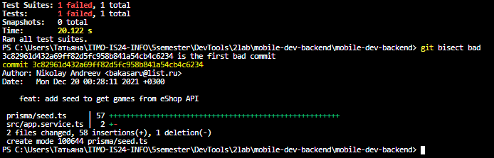 \
Пропишем ресет, чтобы выйти из режима bisect 
```
git bisect reset 
```
## 6. В репозитории существует файл .env, содержащий конфиденциальную информацию. Удалите его из всех коммитов, где он присутствует, и добавьте в .gitignore.
Через фильтр мы можем удалить все файлы типа .env 
```
git filter-branch --force --index-filter "git rm --cached --ignore-unmatch .env" --prune-empty --tag-name-filter cat -- --all 
```
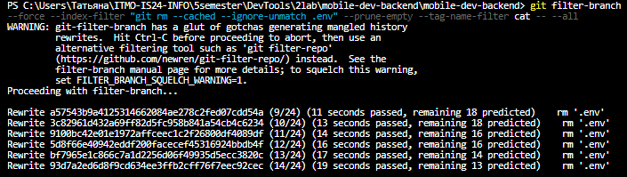 \
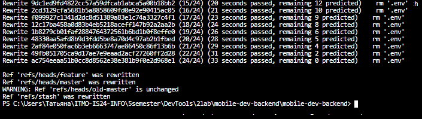 \
Проверим, удалился он или нет
```
git ls-tree -r master --name-only | FINDSTR .env 
```
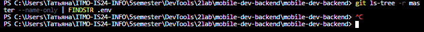 \
Добавим в gitignore 
```
echo ".env" >> .gitignore 
```
## 7. Сделайте так, чтобы автором коммитов в ветке feature были Вы. Для этого укажите в изменяемых коммитах почту, привязанную к GitHub, и своё ФИО.
Переключаемся в ветку feature 
```
git checkout feature 
```
Опять используем filter-branch, задав параметром все желаемые поля коммитов 
```
git filter-branch --force --env-filter "
  GIT_AUTHOR_EMAIL=lyovoch@bk.ru;
  GIT_AUTHOR_NAME=jizapika;
  GIT_COMMITER_EMAIL=lyovoch@bk.ru;
  GIT_COMMITER_NAME=jizapika;" 
```
Далее проверим, что у нас на самом деле произошло.
```
git log --oneline --graph --decorate --pretty=format:'%h%d %s [%an]' --all 
```
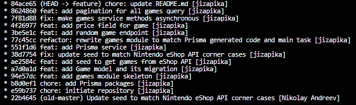
## 8. Включите запоминание разрешений конфликтов. Влейте ветку feature в master, разрешив конфликт при слиянии. Откатите слияние, внесите изменение в файл README.md и снова влейте ветку feature в master без ручного разрешения конфликта.
```
git checkout master 
git config --global rerere.enabled true 
```
Замержим master и feature 
```
git merge feature --allow-unrelated-histories 
```
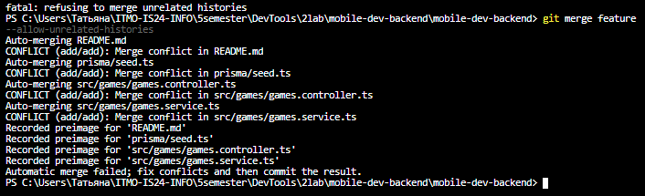 \
Далее вручную решаем возникшие конфликты в 4 файлах и коммитим изменения. 
```
git add . 
git commit
``` 
Мерж удался \
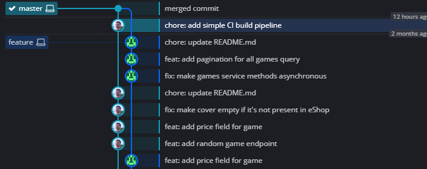 \
Отменим его 
```
git reset --hard HEAD~1 
git merge feature --allow-unrelated-histories 
```
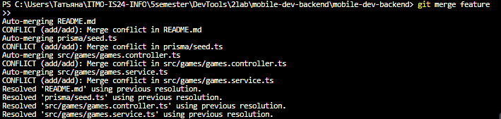 
```
git add . && git commit 
```
## 9. Проверьте целостность репозитория и убедитесь, что с ним всё в порядке. При наличии ошибок исправьте их.
```
git fsck --full 
```
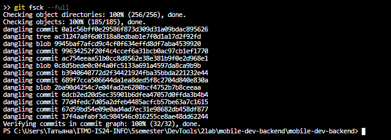 
## 10. Проверьте размер репозитория (папки .git) и добейтесь уменьшения его размера.
Чтобы узнать размер директории .git, нужно прописать это 
```
du -hs .git 
```
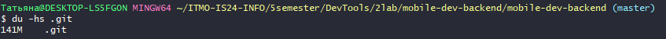 
```
$ git gc --aggressive --prune=now 
```
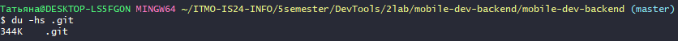
